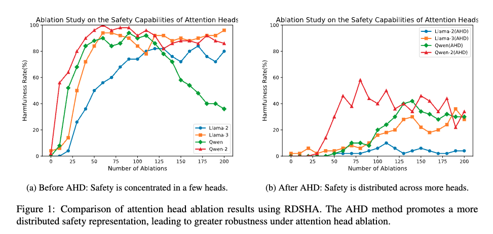

# Safety Alignment Should Be Made More Than Just A Few Attention Heads

<div align="center">

**📄 Paper:** [Arxiv](https://arxiv.org/abs/2508.19697) | **🤗 Models:** [ModelScope Collection](https://modelscope.cn/collections/AHD-0073ac3fa9144a)

[](LICENSE)
[](https://www.python.org/downloads/release/python-3100/)
[](https://pytorch.org/)

</div>

---

## 🔍 Abstract

Current safety alignment for LLMs continues to present vulnerabilities, given that adversarial prompting can effectively bypass their safety measures. Our investigation shows that these safety mechanisms predominantly depend on a limited subset of attention heads: removing or ablating these heads can severely compromise model safety. 

To identify and evaluate these safety-critical components, we introduce **RDSHA**, a targeted ablation method that leverages the model's refusal direction to pinpoint attention heads mostly responsible for safety behaviors. Further analysis shows that existing jailbreak attacks exploit this concentration by selectively bypassing or manipulating these critical attention heads. 

To address this issue, we propose **AHD** (Attention Head Dropout), a novel training strategy designed to promote the distributed encoding of safety-related behaviors across numerous attention heads. Experimental results demonstrate that AHD successfully distributes safety-related capabilities across more attention heads. Moreover, evaluations under several mainstream jailbreak attacks show that models trained with AHD exhibit considerably stronger safety robustness, while maintaining overall functional utility.

## 📊 Main Results

<div align="center">

</div>


## 🚀 Getting Started

This repository is built upon the excellent work from [shallow-vs-deep-alignment](https://github.com/Unispac/shallow-vs-deep-alignment).

### Prerequisites

Install the required dependencies:

```bash
conda create -n AHD python=3.10
conda activate AHD
pip install -r requirements.txt
```

## 🔬 Experiments

### Training with AHD (Attention Head Dropout)

Launch AHD training with the following command:

```bash
python finetune.py \
  --model_name_or_path="/model_dir/Llama-2-7b-chat" \
  --dataset_name="safety_augmentation" \
  --model_family="llama2" \
  --learning_rate=2e-5 \
  --per_device_train_batch_size=4 \
  --gradient_accumulation_steps=1 \
  --output_dir="/model_dir/Llama-2-7b-chat-attn-head-dropout-0.5-GPU1-epoch10" \
  --logging_steps=1 \
  --num_train_epochs=10 \
  --gradient_checkpointing \
  --report_to=none \
  --torch_dtype=bfloat16 --bf16=True --bf16_full_eval=True \
  --save_strategy='no' \
  --sft_type="sft" \
  --use_anchor=True \
  --anchor_batch_size_per_device=16 \
  --safety_augmentation=False \
  --use_warmup=False \
  --use_attention_head_level_dropout=True \
  --head_attn_level_dropout_rate=0.5 \
  --use_skip_anchor_dropout=True \
  --train_log_name="train_log_attn_head_dropout_0.5-epoch10"
```

#### 🔧 Key AHD Parameters

| Parameter | Description |
|-----------|-------------|
| `--use_attention_head_level_dropout=True` | Enable attention head-level dropout |
| `--head_attn_level_dropout_rate=0.5` | Set dropout rate to 0.5 |
| `--use_skip_anchor_dropout=True` | Enable skip anchor dropout |

> **💡 Core Implementation:** The AHD core code is located in `utils/hook_utils.py` in the `get_attn_o_proj_input_hook_random` function.


### 📝 Evaluation

#### 🛡️ Safety Robustness Testing

Test your models against state-of-the-art jailbreak attacks:

| Attack Method | Repository | Instructions |
|---------------|------------|--------------|
| **SI-GCG** | [GitHub](https://github.com/HqingLiu/SI-GCG) | Run their repository with your model path |
| **AutoDAN** | [GitHub](https://github.com/SheltonLiu-N/AutoDAN) | Run their repository with your model path |
| **Adaptive Attack** | [GitHub](https://github.com/tml-epfl/llm-adaptive-attacks) | Run their repository with your model path |

#### ⚡ Utility Evaluation

Evaluate model utility using the comprehensive [lm-evaluation-harness](https://github.com/EleutherAI/lm-evaluation-harness) framework.

## 🤗 AHD Fine-tuned Models

Our fine-tuned models with AHD are publicly available:

<div align="center">

**[📦 ModelScope Collection](https://modelscope.cn/collections/AHD-0073ac3fa9144a)**

</div>

---

## 📚 Citation

If you find this work useful in your research, please consider citing:

```bibtex
@misc{huang2025safetyalignmentjustattention,
      title={Safety Alignment Should Be Made More Than Just A Few Attention Heads}, 
      author={Chao Huang and Zefeng Zhang and Juewei Yue and Quangang Li and Chuang Zhang and Tingwen Liu},
      year={2025},
      eprint={2508.19697},
      archivePrefix={arXiv},
      primaryClass={cs.CR},
      url={https://arxiv.org/abs/2508.19697}, 
}
```

---

<div align="center">

**⭐ If you find this project helpful, please consider giving it a star! ⭐**

</div>


